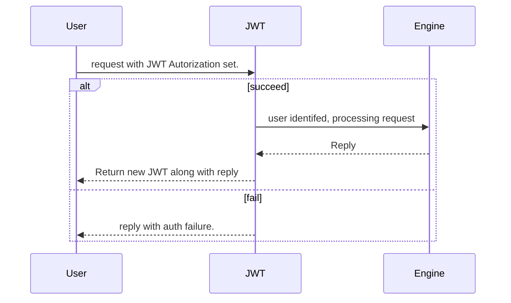
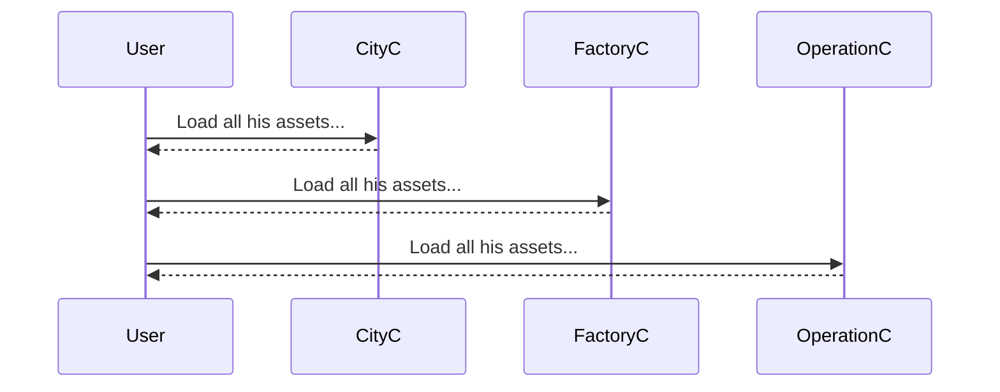
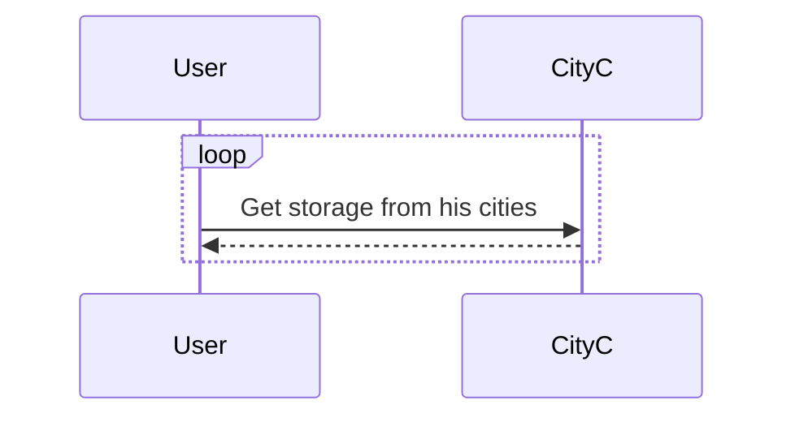
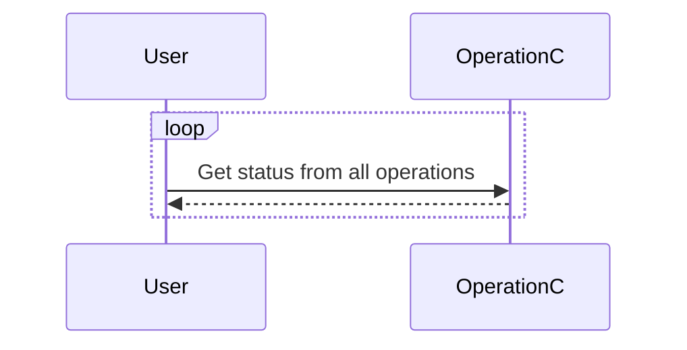
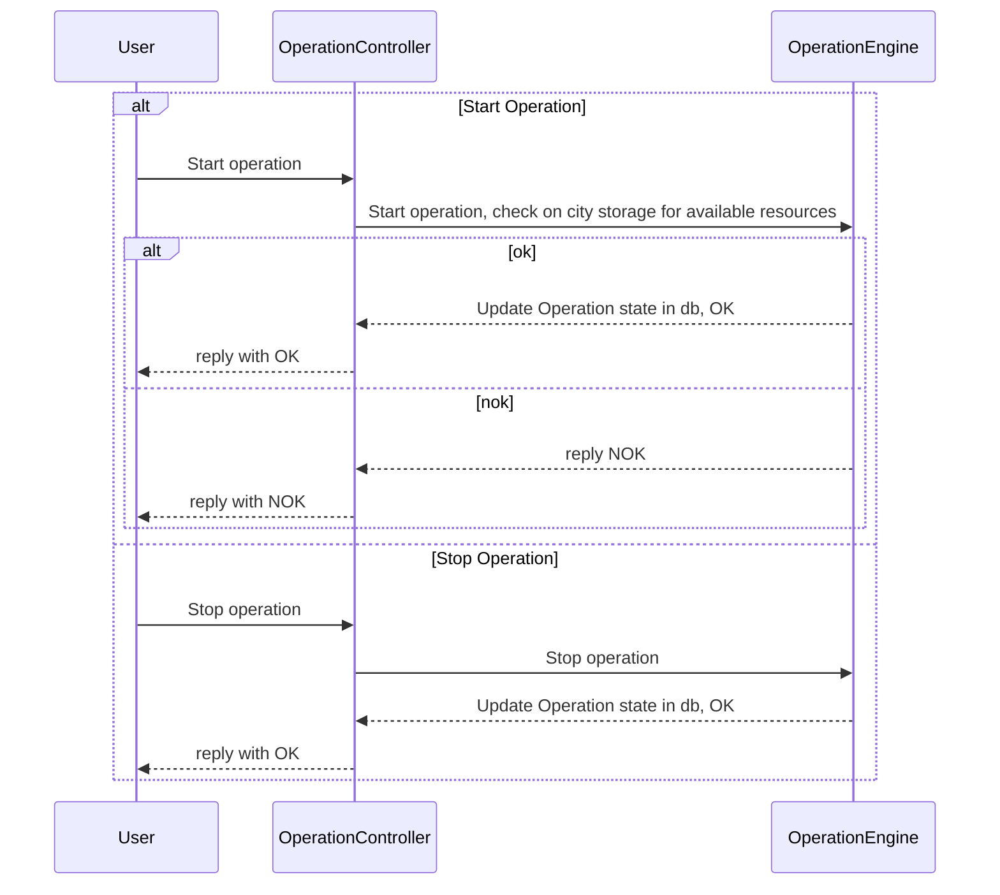

# CityEngine Layout

Basic layout of the engine detailed.

* Controllers: define WEB API
* Repositories: Access Database or InMemory State
* Services: Mechanics of the engine
* Middleware: Filter and stuff, mostly JWT
* Resources: Java Spring stuff

## Workflow

### Authentication

City engine isn't able to perform a true authentication, it expect the request to provide a JWT: a HTTP Header in the **Authorization** field.

The JWT Middleware will then contact **REDIS** service and check the provided JWT. If it get a match, a *user_id* will be returned, along a new *jwt,* the provided one being consummed by the operation. (see KeygenService, see [JWT](middleware/README.md))

### City Management

**V0**: Not much will be done there, as the city will be mostly static for now.

See [City Controller](controllers/README.md#City), [Repository](repositories/README.md#City), [Service](services/README.md#City)

Mostly expect routes:
* GET /cities: Grab all cities(names, mostly) present in memory/db
* GET /city/{id}: Grab specified city fully, including all factories linked to it, that are viewable by the user. Also, retrieve user's storage in this city.

### Factory Management

**V0**: Not much will be done there, as the factories will be mostly static for now.

See [Factory Controller](controllers/README.md#Factory), [Repository](repositories/README.md#Factory), [Service](services/README.md#Factory)

Mostly expect routes:
* GET /city/{city_id}/factories: Grab all factories(names, mostly) present in memory/db
* GET /city/{city_id}/factory/{id}: Grab specified factory fully, including all its operations. 

### Operation Management

**V0** This is were the initial job will be done the most, albeit in a limited fashion.

See [Operation Controller](controllers/README.md#Operation), [Repository](repositories/README.md#Operation), [Service](services/README.md#Operation)

Routes:
* GET /city/{city_id}/factory/{factory_id}/operations: Grab all operations states. 
* POST /city/{city_id}/factory/{factory_id}/operation/{operation_id}/stop: Stop the operation
* POST /city/{city_id}/factory/{factory_id}/operation/{operation_id}/start: start the operation
* POST /city/{city_id}/factory/{factory_id}/operations/stop: Stop all soperation
* POST /city/{city_id}/factory/{factory_id}/operations/start: start all operations

### Overall

Note: Each request from User consume a JWT

#### Initialization

#### Connected and Ready.

Expect a loop to check on cities storage every minutes to keep track of things.
Later, might have some **DeltaRessource** which will remove the necessity to use such a mechanism

Same with operations, albeit with a quicker refresh rate.

#### Start/Stop Operation 

**VO** that's the only TRUE action the user can have.

## Engines

