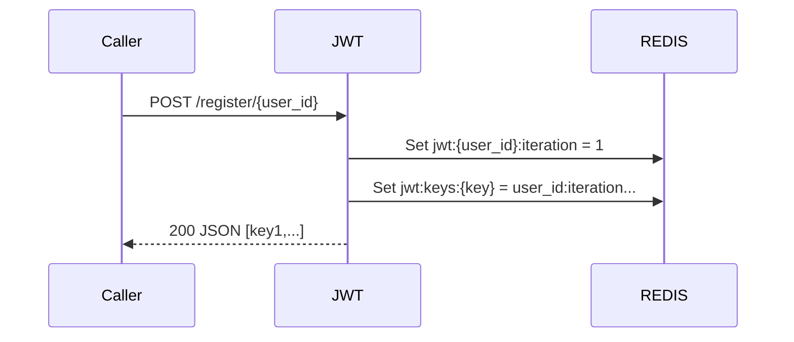
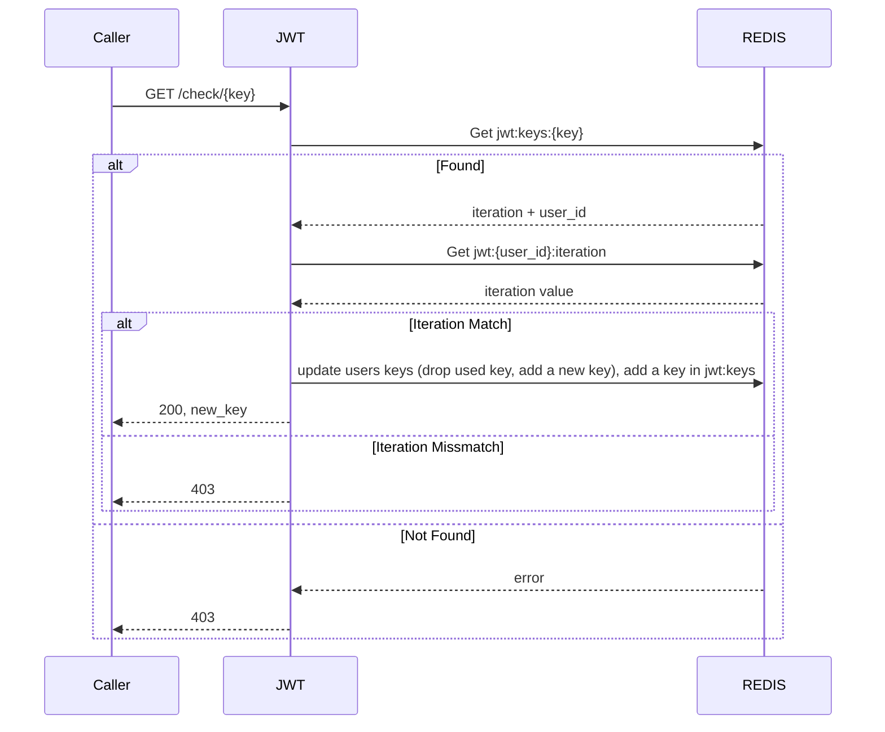

# JWT

JSON Web Token service ensure that a user is correctly logged already. It is like a SSO.
The user first has to authenticate somewhere, then he is provided a bunch of keys, that will need to be provided on each subsequent request it does. 
These keys will then be checked out in this service for validity. 
Should the key be valid, it will be purged from the accound and another one will be added and returned.

## Use Cases & Routes

### Initialization

This first call sets up the database with appropriate information.

**Note:** TTL is set to 1 hour. Afterwich, individual keys will be expurged.

Calling it once more increase iteration by one.

#### Iteration

Iteration check allow to discard a whole bunch of keys for a user (invalidating them all) 

### Check

