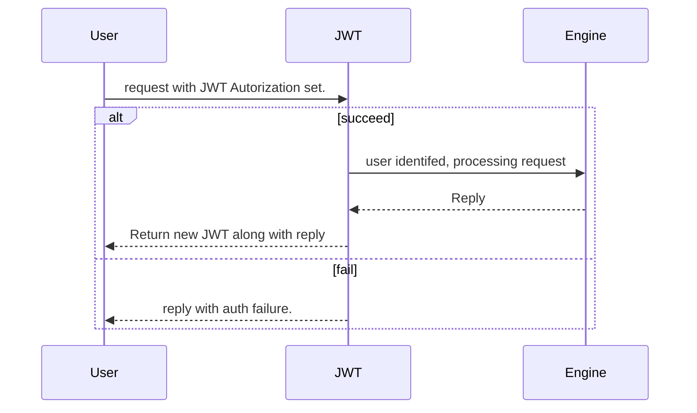
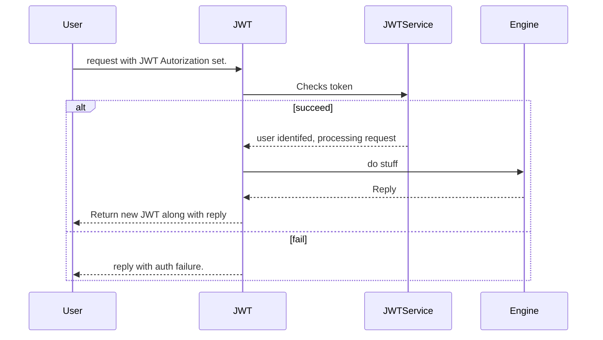

# Middlewares

## JWT

### Workflow

City engine isn't able to perform a true authentication, it expect the request to provide a JWT: a HTTP Header in the **Authorization** field.

The JWT Middleware will then contact **REDIS** service and check the provided JWT. If it get a match, a *user_id* will be returned, along a new *jwt,* the provided one being consummed by the operation. (see KeygenService, see [JWT](middleware/README.md))

And now, internally it's something similar.

### Layout

**JWT** is bundled in two classes: **JWTWebFilter** & **JWTService**

**JWTWebFilter** is the actual filter as integrated to Spring request handling stack. It is applied to every requests. 
Maybe later we will ensure that the filter is restricted to a subset of queries, allowing us to have a separate, unauthorized or differently authorized API to handle administrative requests.

**JWTService** will be the holder of a WebClient, connected to the JWT Provider and checker actual. It will perform the check and return appropriate data.
